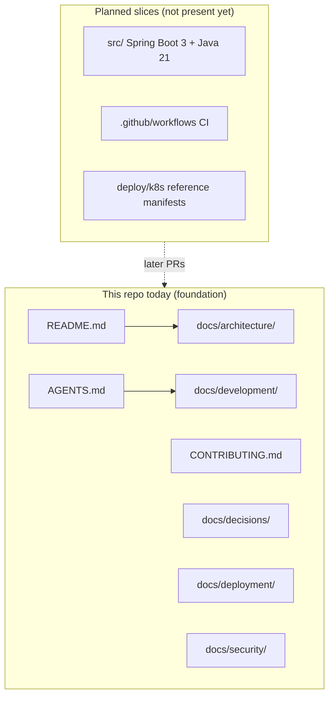

# Architecture diagram

## Foundation slice

This slice has documentation surfaces only. A Mermaid diagram of the running system belongs when the Spring Boot application (and later container/k8s boundaries) exist. Until then, the diagram below is an explicit **placeholder of doc surfaces**, not a fake application topology.

When the application slice lands, replace this figure with components that exist in the tree (Application, controller, Actuator, container). When the k8s slice lands, show the AKS boundary as **aspirational / reference** unless a real apply is documented.
