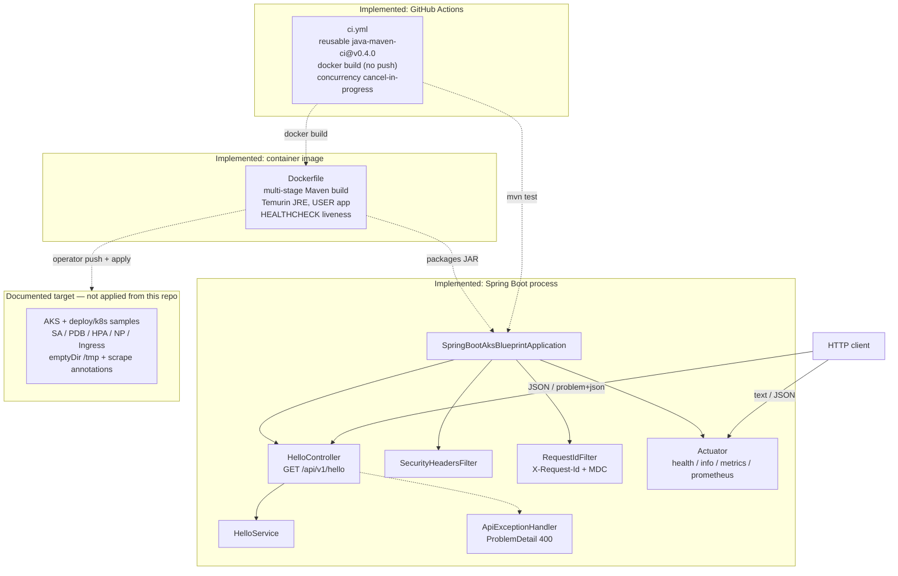

# Architecture diagram

Mermaid view of components **that exist in the tree**. AKS appears only as a documented target.

## How to read it

| Piece | In tree? |
| --- | --- |
| `HelloController` / `HelloService` | Yes |
| `ApiExceptionHandler` (Problem Details) | Yes |
| `SecurityHeadersFilter` / `RequestIdFilter` | Yes |
| Actuator `health` / `info` / `metrics` / `prometheus` | Yes |
| Virtual threads + Tomcat timeouts + compression + forward-headers | Yes |
| Multi-stage non-root Dockerfile + Compose healthcheck | Yes |
| CI (`mvn test` + docker build, no push) | Yes |
| `deploy/k8s/` sample manifests | Yes — reference only |
| Live AKS apply / registry push | **No** — not claimed |
| springdoc-openapi | Deferred — see api-errors.md |

When the runtime shape changes, update this file in the same PR.

## Ops notes (v1.1+ / Unreleased)

- Dockerfile/Compose HEALTHCHECK and k8s probes share Actuator liveness/readiness paths.
- Graceful shutdown + `terminationGracePeriodSeconds` documented under operations.
- Config vs Secret patterns: [config-secrets.md](../deployment/config-secrets.md).
- Prometheus scrape path + optional pod annotations; request-id logging via `logback-spring.xml`.
