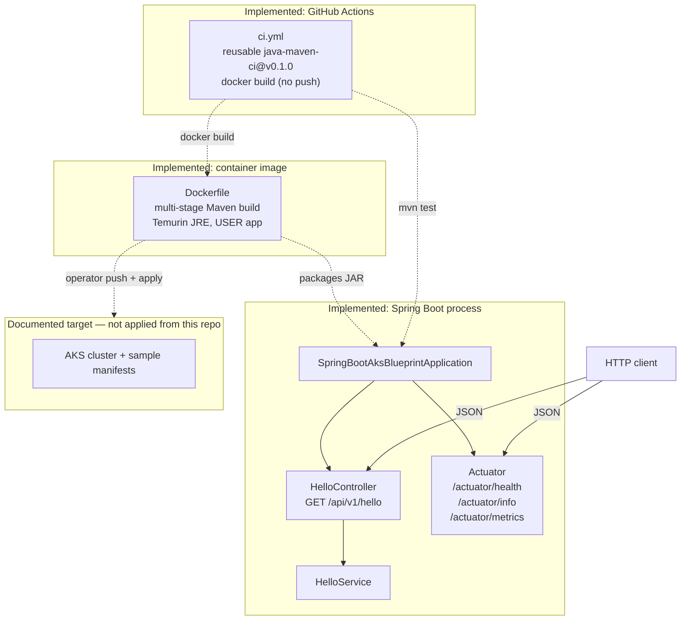

# Architecture diagram

Mermaid view of components **that exist in the tree**. AKS appears only as a documented target.

## How to read it

| Piece | In tree? |
| --- | --- |
| `HelloController` / `HelloService` | Yes |
| Actuator `health` / `info` / `metrics` only | Yes |
| Multi-stage non-root Dockerfile | Yes |
| CI (`mvn test` + docker build, no push) | Yes |
| `deploy/k8s/` sample manifests | Same PR as this diagram when landed |
| Live AKS apply / Ingress / registry push | **No** — not claimed |

When the runtime shape changes, update this file in the same PR.
