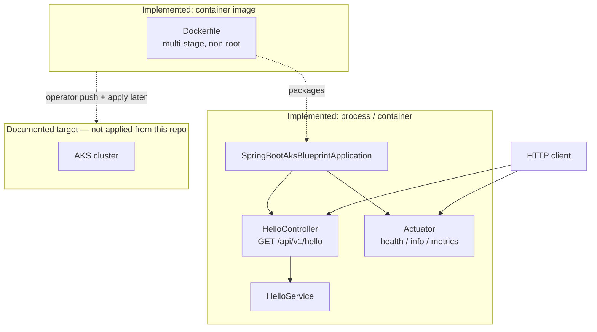

# Architecture diagram

Mermaid view of components **that exist in the tree**. AKS is drawn as an aspirational boundary, not a live deploy.

## How to read it

- **Implemented:** Spring Boot app, carefully exposed Actuator endpoints, unit/WebMvc tests, Dockerfile.
- **Not in this slice:** GitHub Actions, Kubernetes manifests, Ingress, managed databases.
- When CI or `deploy/k8s/` land, update this diagram in the same PR.
