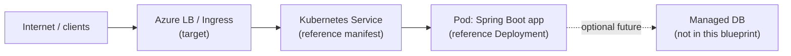

# Network diagram

## Foundation reality

This foundation slice has **no networked runtime** in the tree. There is no Pod, Service, Ingress, or load balancer created by applying manifests from this repository yet.

## Documented AKS target (not implemented here)

The intended topology for a later, operator-owned apply looks like:

| Hop | Status |
| --- | --- |
| Spring Boot process locally | Application slice |
| Container image build | Application slice (Dockerfile) |
| Service + Deployment YAML | k8s slice — **sample/reference** |
| Live AKS apply, Ingress, TLS, DNS | **Out of scope** unless an operator documents a real apply |

Update this file in the same PR that adds real components or changes the documented target. Keep secrets out of labels.
