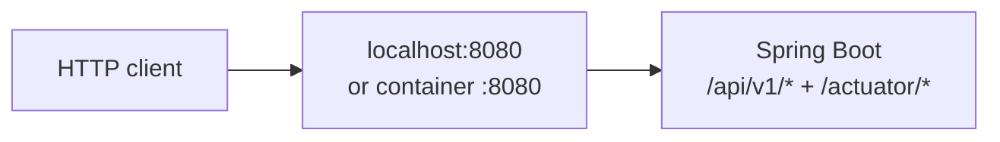
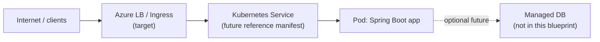

# Network diagram

## Implemented today

| Hop | Status |
| --- | --- |
| JVM process on `SERVER_PORT` (default 8080) | Implemented |
| Container exposing 8080 | Implemented (Dockerfile) |
| Kubernetes Service / Pod | Not in tree yet |
| Azure LB / Ingress / TLS / DNS | Documented target only |
| Database | Optional future — not in this blueprint |

## Documented AKS target (not implemented here)

Update this file when manifests or real network boundaries are added. Keep secrets out of labels.
