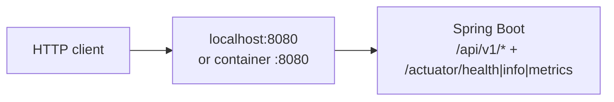
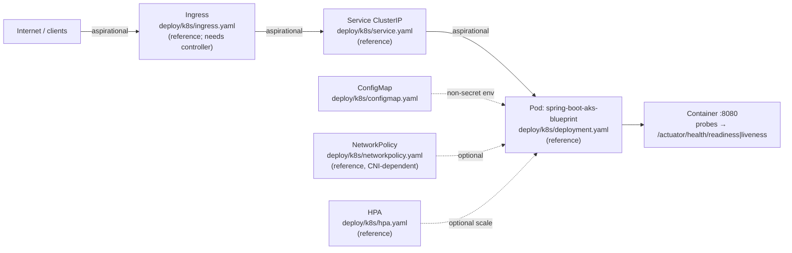

# Network diagram

Clearly separates **implemented** local/container traffic from the **aspirational AKS** path.

## Implemented today

| Hop | Status |
| --- | --- |
| JVM process on `SERVER_PORT` (default 8080) | Implemented |
| Container exposing 8080 (non-root) | Implemented |
| GitHub Actions docker build (no push) | Implemented |
| Kubernetes Service / Pod (sample YAML) | Reference manifests only — not applied |
| Azure LB / Ingress / TLS / DNS | Sample `ingress.yaml` is reference only; live endpoint is operator-owned |
| Database | Not in this blueprint |

## AKS target (aspirational — labeled)

Sample manifests under `deploy/k8s/` describe ClusterIP Service → Pod. They are **reference**. Applying them, attaching an Ingress, and publishing a public URL are operator steps outside this repository.

### Legend

- **Implemented:** solid edges in the first diagram; runnable on a laptop or in CI’s docker build.
- **Aspirational / reference:** dashed intent in the second diagram; YAML exists for learning and copy-adapt, not as proof of a live AKS deployment.

Keep secrets out of labels, ConfigMaps, and commit history.
